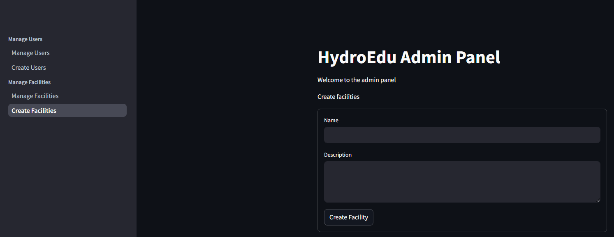

# 進度報告

## 系統架構

### 技術堆疊 (Tech Stacks)

#### 前端技術

- **Framework**: React + TypeScript
- **CSS Framework**: Tailwind CSS
- **Rendering**: Server-Side Rendering (SSR)
- **State Management**: Redux Toolkit
- **API Client**: Axios
- **UI Components**: shadcn/ui

#### 後端技術

- **Framework**: FastAPI
- **Authentication**: JWT + OAuth2
- **API Documentation**: Swagger/OpenAPI
- **WebSocket**: FastAPI WebSocket

#### 資料庫

- **主要資料庫**: MongoDB
  - 使用者資料
  - 農場資訊
  - 作物紀錄
- **快取系統**: Redis
  - Session 管理
  - API 快取
  - 即時訊息

#### AI 部署

- **推理引擎**: Ollama
- **模型格式**: GGUF
- **部署方式**: Docker Container
- **負載平衡**: Nginx

## 網頁

### 進度

- [x] 首頁
- [x] 登入
- [x] Dashboard
- [x] AI Chat
- [x] 我的農場
- [x] 學習中心
- [x] 社群

### Demo

> 首頁

> 登入

> Dashboard

> AI Chat

> 我的農場

> 學習中心

> 社群

## Admin Panel

### 進度

- [x] 登入

### Demo

> 登入

> 管理使用者

> 建立使用者

> 管理農場

> 建立農場

## AI

### 農作物狀態辨識模型

#### 模型架構

- 基礎模型: LLaMA 3.1
- 視覺編碼器: CLIP
- 訓練資料: 自建農作物狀態資料集
- 量化方式: 4-bit QLoRA

#### 功能特色

- 農作物狀態即時辨識
- 多模態理解與分析
- 低資源需求 (量化後)

#### 訓練進度

- [x] 模型訓練完成
  - 訓練輪次: 10 epochs
  - 最終損失值: 0.876
  - 驗證準確率: 88.7%
- [x] 模型量化
  - 記憶體用量降低: 75%
  - 推理速度提升: 2.3x
  - 準確率維持: 98.5%

#### 效能展示

> 訓練過程中的損失值與準確率變化

> 訓練結果的混淆矩陣

> 量化前後的模型大小與推理速度比較
